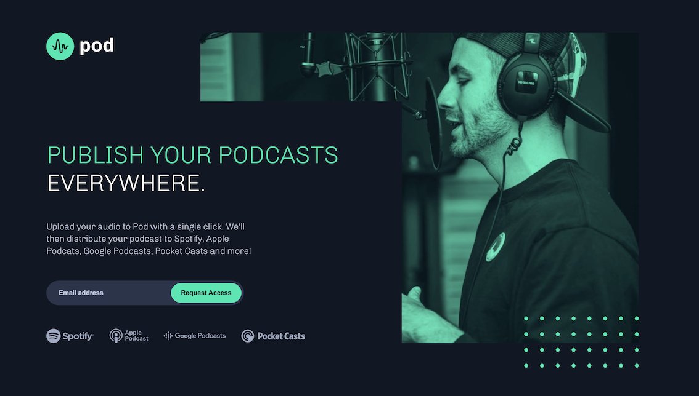

# Pod Request Access Landing Page

## Overview

This project is my solution to the **Pod Request Access Landing Page Challenge** by  
[Frontend Mentor](https://www.frontendmentor.io).

The goal of the challenge was to build a responsive landing page as close as possible to the provided design, including a clean layout, typography, and hover states.

## Screenshot

## Links

- Live Demo: The project was not deployed and was developed locally using the Live Server extension in Visual Studio Code.
- Challenge: https://www.frontendmentor.io/challenges/pod-request-access-landing-page-eyTmdkLSG

## Built With

- HTML5
- CSS3
- Responsive Design (Flexbox)

For this project, I deliberately used plain CSS instead of a CSS framework or preprocessor. The focus was on implementing layouts, media queries, and component styling from scratch in order to strengthen my understanding of core CSS concepts.
